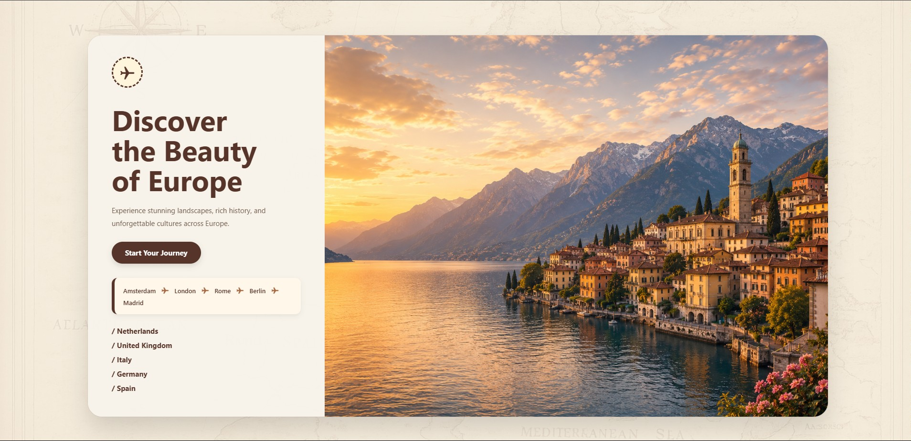
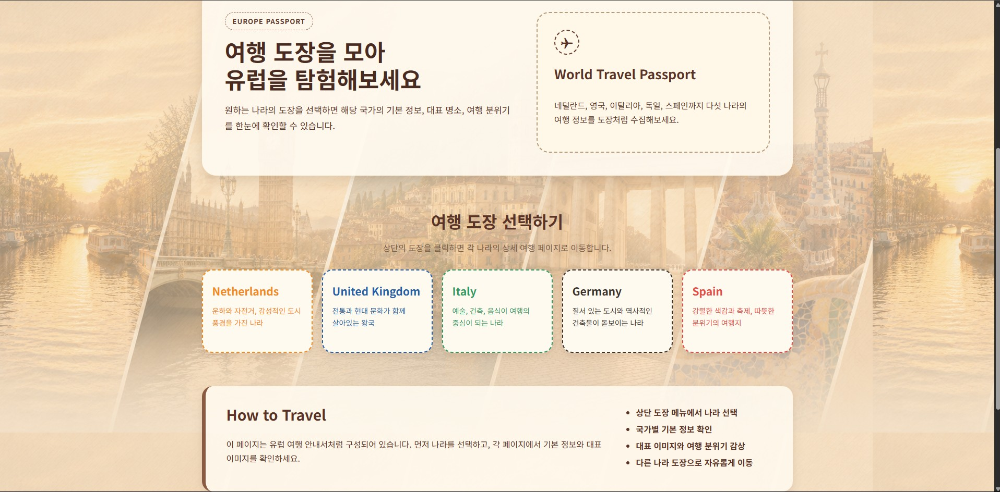
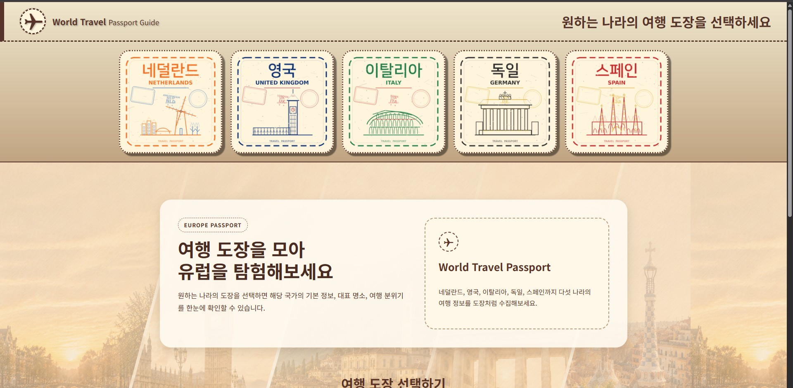
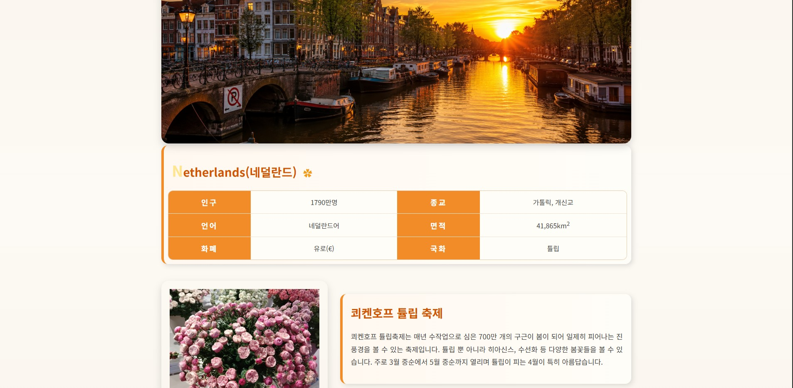
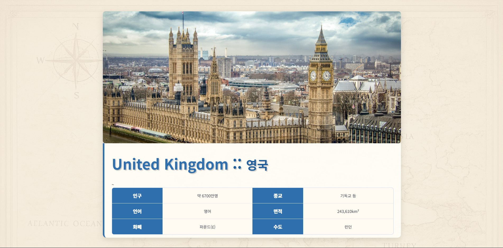
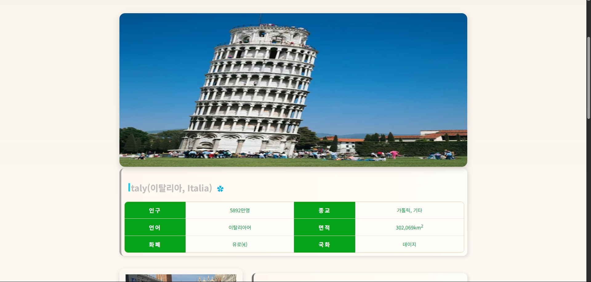
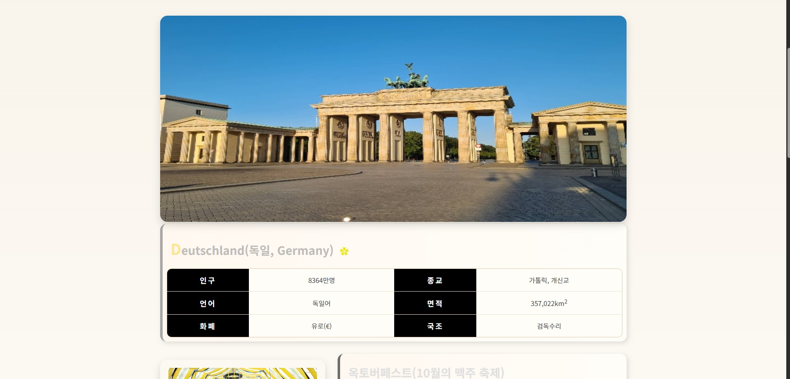
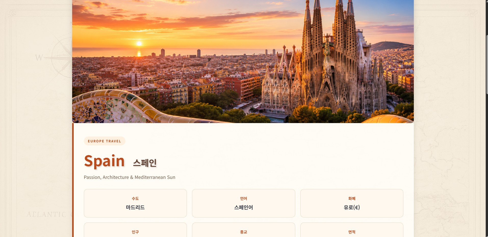
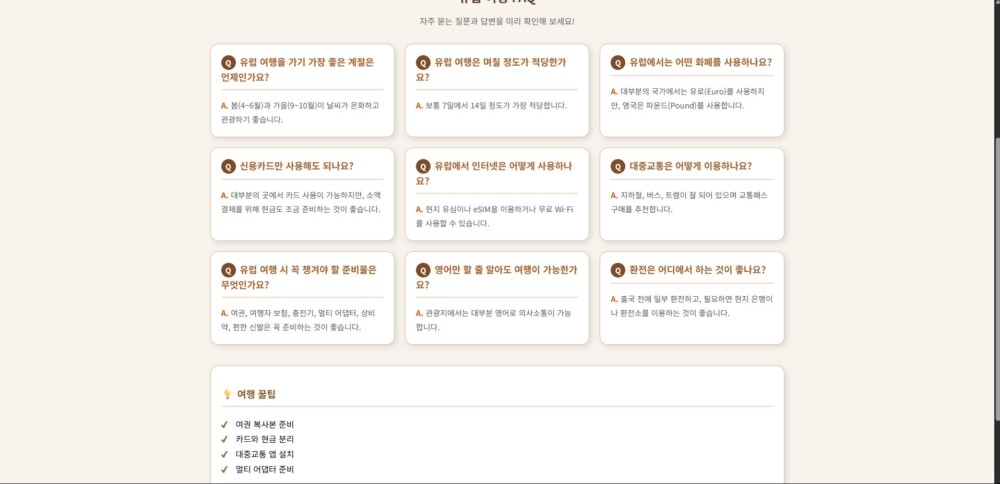

# [TEAM] Europe Travel Project - 우태식, 박용진, 박세희, 정호영

## 1. 프로젝트 소개 및 선정 이유

이 프로젝트는 HTML, CSS를 활용하여 유럽 여행 정보를 제공하는 웹사이트를 제작한 팀 프로젝트입니다.

유럽의 다양한 국가와 대표 도시를 소개하고 여행 정보를 제공하는 것을 목표로 하였으며, Git과 GitHub를 활용한 협업 과정을 경험하기 위해 진행하였습니다.

---

## 2. 사용 기술

- HTML5
- CSS3
- Git
- GitHub
- Visual Studio Code

---

## 3. 팀원 역할

| 이름 | 담당 영역 |
|------|-----------|
| 우태식 | Netherlands Page, FAQ Page |
| 박용진 | Landing Page, Spain Page |
| 박세희 | Main Page, United Kingdom Page |
| 정호영 | Germany Page, Italy Page |

---

## 4. 이미지

### 4-1. Landing Page

#### 설명

- 프로젝트의 시작 화면입니다.
- Start Your Journey 버튼을 통해 메인 페이지로 이동할 수 있습니다.

---

### 4-2. Main Page

#### 설명

- 국가별 여행 정보를 선택할 수 있는 메인 페이지입니다.
- 각 국가 페이지로 이동할 수 있습니다.

---

### 4-3. Header

#### 설명

- 모든 페이지에서 공통으로 사용되는 Header 영역입니다.
- Home 및 국가별 메뉴 이동 기능을 제공합니다.

---

### 4-4. Netherlands Page

#### 설명

- 네덜란드의 기본 국가 정보를 제공합니다.
- 큐켄호프 튤립 축제와 킹스데이를 소개합니다.

---

### 4-5. United Kingdom Page

#### 설명

- 영국의 기본 국가 정보를 제공합니다.
- 타워 브리지, 근위병 교대식, 박물관 문화를 소개합니다.

---

### 4-6. Italy Page

#### 설명

- 이탈리아의 기본 국가 정보를 제공합니다.
- 베네치아 카니발, 베니스 국제 영화제, 로마·밀라노·나폴리를 소개합니다.

---

### 4-7. Germany Page

#### 설명

- 독일의 기본 국가 정보를 제공합니다.
- 옥토버페스트, 베를린 국제 영화제, 베를린·함부르크·뮌헨을 소개합니다.

---

### 4-8. Spain Page

#### 설명

- 스페인의 기본 국가 정보를 제공합니다.
- 바르셀로나, 마드리드, 세비야의 관광 정보를 제공합니다.

### 4-9. FAQ Page

#### 설명

- 유럽 여행 시 자주 묻는 질문과 답변을 제공합니다.
- 여행 기간, 화폐, 교통, 인터넷 사용 방법 등 기본 여행 정보를 확인할 수 있습니다.
- 카드 사용, 환전, 준비물과 같은 실용적인 여행 팁을 제공합니다.
- 사용자가 여행 전 필요한 정보를 빠르게 확인할 수 있도록 구성하였습니다.